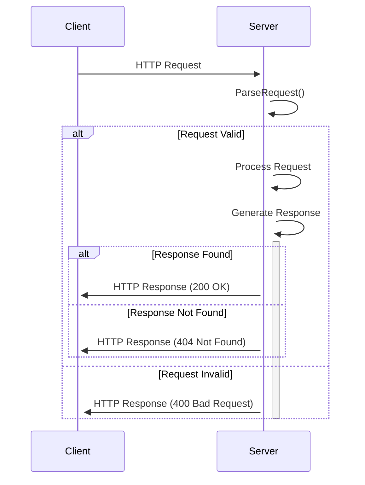

```mermaid
sequenceDiagram
    participant Client
    participant Server

    Client->>+Server: HTTP Request
    activate Server

    Server->>+Server: ParseRequest()
    alt Request Valid
        Server->>+Server: Process Request
        Server->>+Server: Generate Response
        alt Response Found
            Server->>+Client: HTTP Response (200 OK)
        else Response Not Found
            Server->>+Client: HTTP Response (404 Not Found)
        end
    else Request Invalid
        Server->>+Client: HTTP Response (400 Bad Request)
    end

    deactivate Server

```
